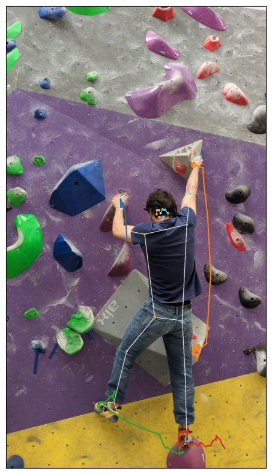

# Climbing wire

## Procedure

### Draw limb traces on the video

1. Load video
1. Compute wireframe
1. Convert landmarks from normalized to image space
1. Compute homographies between current and previous frame
1. Convert old landmarks to current frame reference system
1. Draw the landmarks on the current frame
1. Assemble the video

Here we see an example of the excellent Andrea climbing:

### Wireframe playback

1. Load the videos.
1. Align the videos:
    1. Compute homographies between the two videos' frames.
    1. Compute some distance related to the homographies.
    1. Use dynamic time warping to align the two videos.
       The empty video will be shorter: repeat frames as needed.
1. Compute wireframe on current frame.
1. Get the homography between current frame and reference.
1. Convert wireframe to reference frame.
1. Plot it.
1. Assemble the video

### Phantom trace

1. Leave a trace in the video.
1. Get segmentation mask.
1. Blend the person on the current frame, use lower opacity for older frames.

### Background stitching

* as we can segment person/background, we could build the background by stitching it from frames where the person is not there, thus needing a single video

## Open points and ideas

* if a landmark is missing try to use the others
* how to transform a whole wireframe (LandmarkListImg)
* how to deal with sharp movement
* image -> segmentation mask ?
* should compute_homography be part of a class?
  so something like `ch = ComputeHomography(img1, img2)`
  and in ch you have all the intermediate results
  (and you can call ch.plot_matches() or ch.plot_homography() or ch.plot_warped() or ch.warp(points))
  (and we need them to compute the distance between the two frames)
  the distance can just be the sum of the squared distances between the warped corners

* consider the framerate when using DTW

* tune visibility threshold for landmarks, might need some outliers removal
  (we can leverage the visibility of the landmarks to remove outliers)
* inside a plotter class to draw joint traces ?
* plot landmarks with different colors depending on visibility
* line thickness proportional to speed

* LandHist to track a single joint in the past, keep track of visibility and update with homography old landmarks

* Initializing the jointTracker with the first frame solves several problems:
  - we can call the process func just with the next frame
  - if the landmark computation fails we do not update the `prev_frame` variable and can try with the next frame; currently we lose one step of the homography chain
  - we can use the landmarks from the first frame to initialize the `prev_landmarks` variable
* but the first frame could fail the landmark computation, so we might need the second frame and so on
* also the second frame might fail, so we need to keep track of the last frame that worked

* identify stable points for a joint position and use them to draw the wireframe only for those frames

* width and height are not rows and columns, but height and width
  definitely check which is which and be consistent between numpy and opencv

* compute the fps of the video and save the frames with a timestamp,
  maybe with a lower resolution,
  and save the landmarks with the same timestamp (at the original resolution)

* reload the landmarks with a helper func that converts the json (?) to a LandmarkListImg,
  possibly by building a NormalizedLandmarkList.

* as an android app, do the landmark and homography computation live,
  and show the video with the wireframe and the tracks

* if we compute the landmarks on a lower resolution image, do we lose precision?
  and how much does it speed up the computation?
  what about using a lower model complexity?

* the video iterator is slow if the millisecond interval is small,
  it's faster to just skip some frames.
  if the interval is large, it's better to set the position.
  and rather than a small interval, a keep-every-nth-frame is better for more
  consistent intervals between frames.

* having an homography class lets us set up a progress bar
  we somehow need to pass the func to dtw so that it's linked to the class

* if we use the slow dtw does the matching improve?

## Package structure

#### opencv and homography

* [x] homography computation (SIFT+FLANN+RANSAC)
* [x] perspectiveTransform (with auto reshaping, and auto cast float-int)
* [x] cv_imshow
* [ ] draw matches + polylines
* [ ] warpPerspective + with mask (to be able to warp only the person (or only the background from future frames))

#### mediapipe and landmark

* [ ] normalized_to_pixel_coordinates
* [ ] are_valid_normalized_points
* [ ] LandmarkListNp
* [ ] LandmarkListImg
* [ ] compute_landmarks (image -> wireframe)
* [ ] draw_landmarks
* [ ] get_spec_from_map

#### Video load/create

* [ ] video iterator
* [ ] video_to_frames
* [ ] frames_to_video (a coroutine? so that we can send frames to it)

#### LimbTracker

* init
* add frames one by one

1. compute homography previous to current
1. convert previous points to current
1. compute landmarks for current frame
1. append to the list of landmarks
1. plot the landmarks on the current frame

we lose the first frame but we don't care

verify that the composition of the homographies is the same as the homography between the first and the last frame

## Resources

### Pose tracking

* https://colab.research.google.com/drive/1uCuA6We9T5r0WljspEHWPHXCT_2bMKUy

### Homography

* https://docs.opencv.org/3.4/d1/de0/tutorial_py_feature_homography.html
